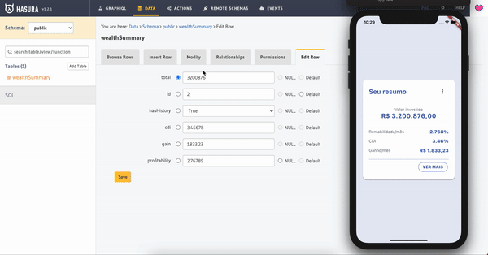
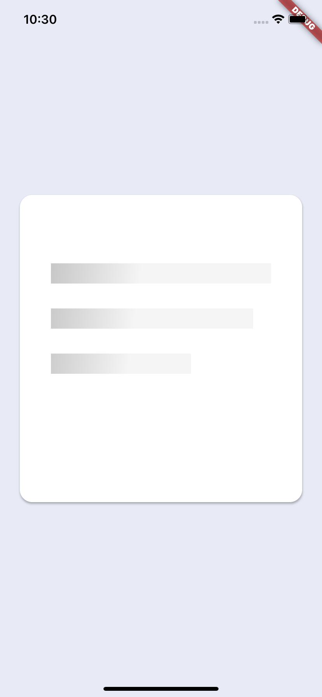
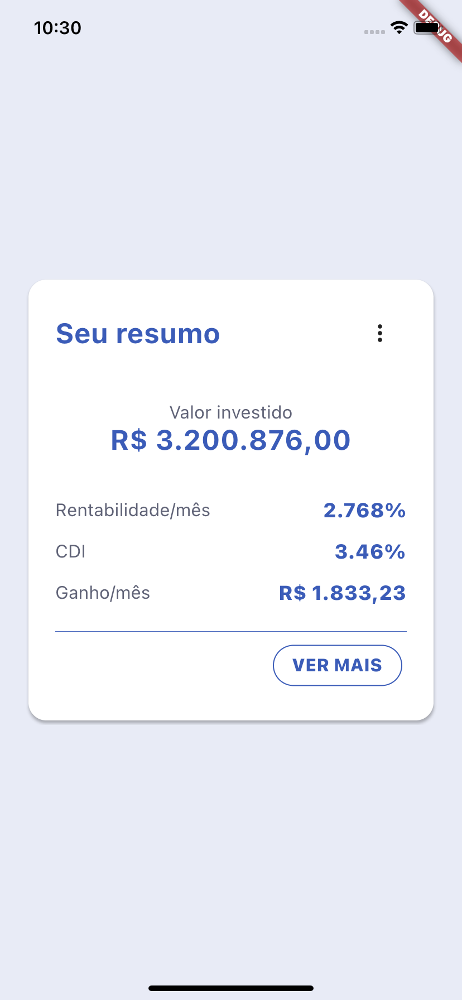

# Challenge Flutter Fliper



| Loading                                                              | Home                                                                |
| -------------------------------------------------------------------- | ------------------------------------------------------------------- |
|  |  |

Este projeto faz parte do desafio técnico, onde é construdo um app flutter capaz de consultar uma api [graphql](https://graphql.org/) e exibir os resultados na tela inicial do app.

## Arquitetura do projeto

Este projeto está divido em 3 módulos, o [challenge_service](https://github.com/iranjunior/challenge_service), [challenge_app](https://github.com/iranjunior/challenge_app), e o [challenge_ui](https://github.com/iranjunior/challenge_ui). Cada módulo tem seu papel, para compor o app. O detalhamento dos módulos está disponível abaixo:

| módulo              | descrição                                                                                                                                                                                                                                       |
| ------------------- | ----------------------------------------------------------------------------------------------------------------------------------------------------------------------------------------------------------------------------------------------- |
| `challenge_service` | Este módulo fornece os schemas, e subscription graphql para o app. A requisição graphql usada no app, está locada aqui. E pode ser alterado, incrementado, sem a total necessidade de alterar o app.                                            |
| `challenge_ui`      | Este módulo fornece widgets customizados, para o app. Aqui está disponível widgets que estão no padrão de adotado em todo app, com as cores padrão, tamanhos das fonts, e etc. E podendo ser alterado, sem a total necessidade de alterar o app |
| `challenge_app`     | Este módulo é do app. Aqui é onde os outros módulos são agrupados. Onde os outros módulos são carregados como sendo um dependência normal, e por fim sendo usado conforme a sua necessidade.                                                    |

## Como rodar o projeto

Para executar o projeto você precisa ter o [git](https://git-scm.com/book/en/v2/Getting-Started-Installing-Git) instalado. E se você tiver com ele instalado basta executar:

```bash
https://github.com/iranjunior/challenge_flutter.git # baixar o repositório
git submodule update --init # atualiza os submódulos
```

Com o projeto baixado na sua máquina, será necessário baixar as dependências de cada módulo. Para isso você pode executar os comandos abaixo:

```bash
chmod 755 ./start.sh
./start.sh
```

E por fim, para rodar o projeto basta executar:

```bash
cd challenge_app
flutter run
```

